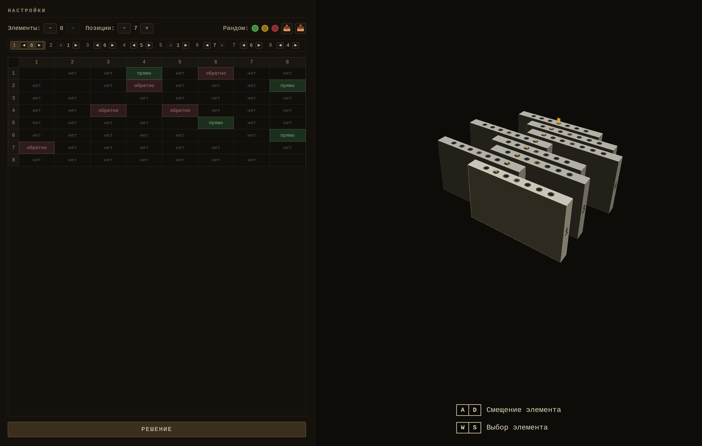
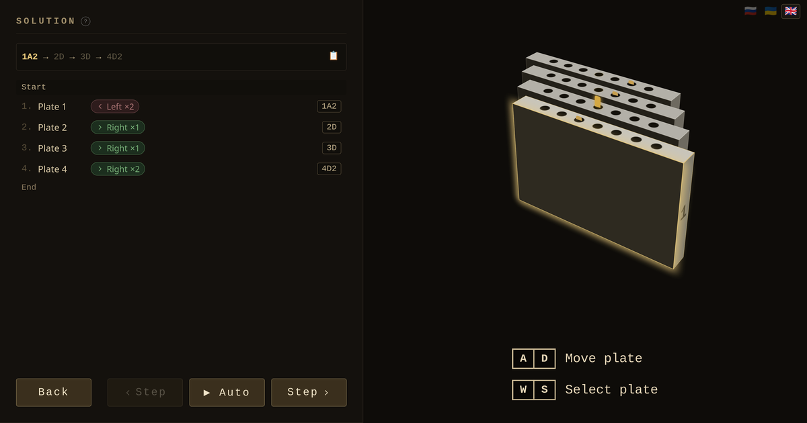

# Gothic Lockpick Solver

Браузерный решатель и визуализатор головоломки с дисковыми замками — механика взлома из Gothic и подобных RPG.

**Запуск:** открыть `index.html` в браузере. Зависимостей нет, сборки нет.





---

## Что это такое

Головоломка — N плашек на линейной шкале позиций. Каждая плашка может двигаться влево или вправо. Плашки связаны зависимостями: движение одной тянет связанные плашки в том же или обратном направлении. Зависимости не транзитивны — если A→B и B→C, то движение A затрагивает только B. C реагирует лишь когда B двигают напрямую. Цель — привести все плашки в центральную позицию одновременно.

Приложение:
- визуализирует конфигурацию в 3D-изометрической сцене
- решает головоломку через BFS (поиск в ширину) с гарантией минимального количества ходов — а среди всех минимальных решений выбирает то, где меньше всего переключений между плашками (короче список шагов)
- пошагово воспроизводит решение
- генерирует случайные конфигурации заданной сложности

---

## Использование

### Язык интерфейса

В правом верхнем углу — три кнопки-флага: 🇷🇺 Русский / 🇺🇦 Українська / 🇬🇧 English. Выбор сохраняется в `localStorage`.

### Вкладка настроек

| Элемент | Действие |
|---|---|
| **Элементы −/+** | Количество плашек (2–8) |
| **Позиции −/+** | Нечётное количество позиций (3, 5, 7, …) |
| **🟢 🟡 🔴** | Случайная конфигурация: лёгкая / средняя / сложная |
| **📤** | Копировать конфигурацию в буфер (JSON) |
| **📥** | Импортировать конфигурацию из буфера |
| **Ctrl+C** | Копировать текущую конфигурацию |
| **Ctrl+V** | Вставить конфигурацию из буфера |
| **🔍 / Ctrl+K** | Открыть поиск по базе реальных замков из игры |
| **РЕШЕНИЕ** | Запустить BFS и перейти к решению |

Барабан позиций (колонка `+ / цифра / −` на каждую плашку, над матрицей) и **клик по дырке в 3D-виде**:
- выставляют позицию напрямую, **без проверки зависимостей** — инструмент конфигурации: любое положение задаётся независимо от других плашек
- цифру можно ввести с клавиатуры; `+ / −`, стрелки `↑ / ↓` **и колесо мыши над цифрой** меняют позицию на ±1
- в 3D-виде при наведении на дырку — подсветка; клик (или тап) выставляет позицию той плашки, по дырке которой кликнули
- все правки позиции проходят через единый обработчик (`posSetPlateValue`), поэтому 3D, кэш решения и подсказки обновляются согласованно

Матрица зависимостей:
- **ЛКМ** — переключить связь: нет → прямо → обратно
- **ПКМ** — переключить в обратную сторону
- Диагональ (самозависимость) заблокирована и обозначена полосками
- На узких экранах вместо слова показывается иконка направления (стрелки в одну сторону = «прямо», врозь = «обратно»); цвет наследует цвет ячейки

Управление плашками клавиатурой:
- `W / S` или `↑ / ↓` — выбор активной плашки
- `A / D` или `← / →` — сдвинуть активную плашку

### Вкладка решения

Решение отображается строкой нотации сверху и списком шагов-карточек. Каждый шаг — карточка: элемент, цветной значок направления (зелёный = вправо, красный = влево) с кратностью `×N`, и код в нотации справа. Текущий шаг подсвечен; активная плашка одновременно подсвечивается в 3D-сцене.

| Кнопка | Действие |
|---|---|
| **‹ Шаг** | Шаг назад по решению |
| **▶ Авто** | Автовоспроизведение (500 мс/шаг) |
| **Шаг ›** | Шаг вперёд по решению |
| **Вернуться** | Вернуться в настройки |

Нажать на шаг в списке — перейти к нему напрямую.

### Режим исследования

Нажатие `A / D` или `← / →` в режиме решения автоматически входит в **режим исследования**:

- Авто-воспроизведение останавливается.
- Плашки можно двигать свободно, независимо от BFS-решения.
- Последовательные ходы одной плашки в одном направлении схлопываются в одну запись (`1A3` вместо `1A 1A 1A`); обратные ходы схлопываются в обратную сторону.
- Если ход заблокирован, мешающая плашка подсвечивается красным и дёргается на 250 мс.
- В списке шагов появляется разделитель **↩ вернуться к шагу N** — клик по нему или по любому пройденному BFS-шагу возвращает к решению.

### Поиск по базе замков

🔍 (или `Ctrl+K`) открывает поиск по базе реальных сундуков/дверей из **Gothic 1 Remake**. Кнопка недоступна (с подсказкой почему), если не загрузились база или библиотека поиска.

Одно поле, режим определяется автоматически:

- **Текст** — нечёткий поиск (опечатки не страшны) по названию и тегам сразу на всех 4 языках базы (ru/en/de/uk), независимо от текущего языка интерфейса
- **Позиции** — точный поиск по расположению дисков. Поддерживается:
  - через запятую: `4,0,6,3,2,1`
  - компактно, по одной цифре на позицию: `406326`
  - и так и так — учитывается сдвиг на +1 (если считать позиции с 1, а не с 0)

`↑/↓` — выбор результата без потери фокуса в поле, `Enter` или клик — применить найденную конфигурацию (переход на вкладку настроек).

### Подсказки-совпадения

По мере ввода начальных позиций между барабаном и матрицей появляется ряд карточек реальных замков из базы, чьи диски совпадают с текущими **по префиксу слева**. Это способ найти замок по видимым дискам и получить его скрытые правила зависимостей.

- **Совпадение** считается детерминированно (позиции пользователя 1-based → 0-based базы, без «пробуем оба варианта», как в текстовом поиске).
- **Балл совпадения**: `score = prefix · (0.7 + 0.3 · count)`, где `prefix = L / N` (`L` — длина совпавшего префикса, `N` — число плашек), `count = 1 / (1 + |дисков − N|)`. Умножение делает префикс обязательным: замок без позиционного совпадения (`prefix = 0`) не всплывёт.
- В список попадают записи со `score > 0.25` (по сути `L ≥ 2`), максимум 3, отсортированные по баллу.
- **Зависимости из матрицы** тоже влияют — но только если что-то введено (пустая матрица ничего не меняет). Оцениваются лишь введённые связи: совпадение направления даёт бонус (`+0.5`), отсутствие связи у замка — мягкий штраф (`−0.2`), противоположное направление — жёсткий (`−1.5`, одно противоречие обнуляет замок, вытянуть могут только сильно перевешивающие совпадения). Позиции остаются обязательными.
- **Яркость** карточки растёт с баллом; полное совпадение (`score ≈ 1`) заметно ярче частичных. **Совпавшие диски** в превью подсвечены зелёным.
- Третья строка карточки — цепочка связей замка в gothic-формате (`A:B-,C+;D:E-`, без позиций). Токены **зелёные**, если совпадают с введёнными в матрицу, **красные** — если противоречат.
- Карточка **кликабельна целиком** — применяет весь конфиг замка (позиции + правила). При наведении полное имя показывается в `title` (в UI оно может быть обрезано).
- Раскладка: имя + теги слева, превью дисков справа. Количество карточек зависит от **ширины панели** (не вьюпорта, через CSS container queries): широкая — 3, уже — 2, узкая — 1.
- Если база не загрузилась (оффлайн/сбой) — ряд просто не показывается, без ошибок.

---

## Нотация ходов

```
<id плашки><направление><кол-во шагов>
```

- `A` = влево, `D` = вправо
- Количество шагов опускается если равно `1`

Примеры: `1A`, `2D3`, `7A2`

Последовательные ходы одной плашки в одном направлении сжимаются: `1A 1A 1A` → `1A3`.

---

## Форматы конфигурации

Импорт распознаёт **четыре формата** автоматически (вставка / `Ctrl+V` → диалог подтверждения; каждый парсер — самодостаточный юнит в блоке `parsers`). Экспорт/копирование выдают gothic или JSON (JSON — по `Shift`).

### JSON

```json
[
  {
    "id": 1,
    "positions": 7,
    "currentPos": 3,
    "deps": [
      { "targetId": 2, "direction": "same", "steps": 1 }
    ]
  },
  {
    "id": 2,
    "positions": 7,
    "currentPos": 5,
    "deps": []
  }
]
```

Ограничения:
- `positions` — нечётное, минимум 3, одинаковое для всех плашек
- `currentPos` — от 1 до `positions`; 1 = крайняя левая **дырка** в плашке (плашка при этом стоит крайне вправо), N = крайняя правая дырка (плашка стоит крайне влево)
- `id` — строго последовательность `1..N`
- `deps.direction` — `"same"` или `"opposite"`
- `deps.steps` — целое положительное число
- Самозависимости (`targetId === id`) не допускаются

### gothic — `позиции + связи`

Компактная строка вида `040615 A:B-,C+;D:E-`: цифры позиций (0-based) и связи в любом порядке. Требует **и** позиции, **и** связи. `+` = `same`, `−` = `opposite`; буквы `A..H` → плашки `1..8`.

> «gothic» — принятое в проекте условное название этой нотации, **не** формат самой игры и не её экспорт; из Gothic 1 Remake пришли только данные базы замков.

### dotted — `N.позиции.пары`

Например `3.531.saaoaa`: `N` плашек, по цифре позиции на плашку (0-based), затем по символу на упорядоченную пару (from-мажорно, self пропущен) — `s` = same, `o` = opposite, `a` = нет связи.

### byte-array (unlockmyloot v2)

Компактный base64url-код (как в `?lock=` на unlockmyloot) — их ссылки импортируются напрямую. Каноничный (фиксированные длины, нулевые pad-биты).

---

## Сложность генерации

| Кнопка | Минимум плашек | Длина решения |
|---|---|---|
| 🟢 Лёгкая | 2 | 7–13 ходов |
| 🟡 Средняя | 5 | 14–20 ходов |
| 🔴 Сложная | 7 | ≥ 21 хода |

Длина считается по сжатой нотации (`1A3` = 1 ход).

---

## Архитектура

**Один файл** — `index.html`, без зависимостей и шага сборки.

### Воркеры

BFS и генерация выполняются в Web Workers через Blob URL — UI не блокируется.

**Solve-воркер** (один) — запускается при нажатии РЕШЕНИЕ, возвращает минимальный путь с групповой оптимизацией (см. ниже).

**Пул random-воркеров** (до 8, по числу CPU) — параллельно перебирают случайные конфигурации. Первый, нашедший подходящую, останавливает остальных через `worker.terminate()`.

Прогресс вычисления отображается в оверлее:
```
Состояний проверено: 5 222 тыс.     ← для BFS
Попытки: 47 / 400 · 5 222 тыс.      ← для рандомизации
├─ #1    5 попыток ·   412 тыс.
├─ #2    8 попыток ·   630 тыс.
...
└─ #8    5 попыток ·   395 тыс.
```

### Решатель (`bfsSolveGrouped`)

Единственный солвер в проекте — им пользуются и кнопка РЕШЕНИЕ, и рандомизатор. Кратчайших по нажатиям решений обычно много, и наивный BFS вернул бы первое попавшееся, которое «зигзагом» скачет между плашками. Поэтому алгоритм трёхфазный, точный:

1. BFS от старта → `distS` до обнаружения цели на глубине `L` (минимум нажатий — гарантия BFS)
2. Обратный BFS от цели по «коридору» кратчайших путей (`distS + distG == L`; ходы обратимы, граф неориентированный)
3. Точный DP по коридору с узлом `(состояние, последняя плашка)` — минимум переключений. Направление в узле не нужно: на кратчайшем пути плашка не может пойти дважды подряд в разные стороны (это возврат в предыдущее состояние)

Итог: минимальное число нажатий и минимально возможный список шагов (напр. 41 нажатие: 30 групп у наивного BFS → 11 у нашего). Для патологически широких коридоров (>200 тыс. состояний) — жадный fallback «предпочитай ту же плашку», по-прежнему минимальный по нажатиям.

Прогресс стримится через `onProgress` каждые 2000 открытых состояний; максимальное пространство — `positions^N` (7 позиций × 8 плашек ≈ 5.7 млн). Сложность рандома фильтруется по длине группового решения — то есть ровно по тому списку шагов, который увидит пользователь.

### Кеш решения

Решение, найденное при генерации (`cachedSolution`), сохраняется и переиспользуется при нажатии РЕШЕНИЕ без изменения конфигурации. Любое изменение (ход клавишей, правка зависимости, смена количества плашек/позиций) инвалидирует кеш. BFS-решение тоже кешируется при первом вычислении.

### Структура скриптов

Блоки `<script>` имеют семантические `id` — вытащить нужный: `grep 'id="<имя>"' index.html`.

```
solver-src    Ядро решателя: center(), computeMove(), нотация,
              bfsSolveGrouped(), compressPath(). Исполняется страницей
              И инъектится в Blob воркера — один исходник, два потребителя
state         Константы, state, makePlate(), TRANSLATIONS, t(), setLanguage()
ui-utils      showToast(), copyToClipboard() — общие UI-утилиты
game-logic    applyMove(), getBlockingPlateId(), flashBlockedPlate()
render         buildScene(), updateScene(), posToOffsetX() (3D-сцена)
parsers       Реестр форматов: validatePlates(), json/gothic/dotted/bytearray,
              PARSERS, parseConfig(), entryToPlates()
config        Барабан позиций (posSetPlateValue — единая точка смены позиции:
              ввод/±/стрелки/колесо/клик по дырке), матрица (renderMatrix,
              depCellHTML), импорт/экспорт, рандомизация
solve-ui      Список шагов-карточек, навигация, авто-воспроизведение,
              addExploreMove(), returnToSolution()
keyboard      Обработчик клавиатуры (config + solve + explore)
init          init()
worker-src    Точка входа воркера: только onmessage (solve + рандомизатор);
  (text/x-worker)  логика — из solver-src
worker-host   createWorker(), пул, прогресс, отмена
db-search     loadChestDb(), Fuse.js поиск, поиск по позициям, рендер карточек;
              computeChestHints() + renderChestHints() — живые подсказки
```

---

## База данных замков

`chests.json` — то, что грузит в браузере поиск (`fetch('chests.json')`). Собирается из трёх слоёв:

```
chests.ini                     сырец: community-набранная база (опечатки,
   │                           разнобой языков; НЕ лежит в репозитории)
   ▼ parse + normalize
tools/db-decisions.json        слой решений («git rerere»): каждое ручное
   │                           решение записано один раз и переигрывается
   ▼ apply                     при каждой пересборке
tools/gaps/ → translations     переводы Google-Translate-раундтрипом
   │                           (заполняют только недостающие языки)
   ▼
chests.json                    итог, коммитится, грузится приложением
```

```bash
npm run build:db    # полная пересборка: ini + decisions → chests.json
npm run review:db   # веб-ревью дублей/обогащений → http://localhost:3210
```

### Канонический ключ

Идентичность замка = `pos.join(',') + '|' + отсортированное множество связей`. Не зависит от порядка записи правил (`B:D-;C:B-` ≡ `C:B-;B:D-`) — старый дедуп сравнивал правила строкой и пропускал переупорядоченные дубли. Все слои (`overrides`, `translations`, очередь ревью) адресуются этим ключом, поэтому решения переживают любые изменения сырца.

### Слой решений — `tools/db-decisions.json`

```json
{ "v": 1,
  "overrides":    [ { "key": "…", "note": "review: dedup", "entries": [ {…} ] } ],
  "additions":    [ { …запись без аналога в ini… } ],
  "translations": { "<key>": { "byId": { "<id>": { "desc": { "de": "…" } } } } } }
```

- **overrides** — каноническая группа из ini заменяется записанными `entries`. Так хранятся: bootstrap-заморозка (см. историю ниже), слитые дубли, обогащения.
- **additions** — записи, которых нет в ini (например, будущие импорты).
- **translations** — переводы по ключу; применяются **только в недостающие языки** (fill-only: машинный перевод никогда не затирает явное имя из ini или отредактированный тобой мёрж). `byId` адресует конкретную запись внутри неслитой группы дублей.

Группы-дубли **без** решения не сливаются молча — попадают в отчёт `REVIEW-NEEDED` и в очередь ревью. Записи без внятного имени не выбрасываются: идут с `name: {}` и стабильным id `lock-<позиции>`, а UI показывает локализованную заглушку «Неизвестный замок».

### Формат записи

```json
{
  "id": "swamp-camp-cor-kalom-hut",
  "name": { "ru": "…", "en": "…", "de": "…", "uk": "…" },
  "desc": { "ru": "…", "en": "…", "de": "…", "uk": "…" },
  "rules": "A:B+,C-;B:A-",
  "pos": [4, 0, 6, 3, 2, 1],
  "tags": ["болотный лагерь", "кор галом"],
  "img": []
}
```

`desc` — опциональное описание (локация + лут); пока только хранится, показ в UI — отдельная задача. `cells` не хранится — считается как `pos.length`.

### Ревью-тулза (`npm run review:db`)

Веб-страница без зависимостей: один пункт очереди за раз, все записи-кандидаты бок о бок + редактируемый итоговый вариант (id, имена/описания по языкам, теги; позиции/правила read-only). «Принять» немедленно пишет решение в `db-decisions.json`, «Пропустить» просто листает. Очередь: канонические группы-дубли + внешние предложения из `tools/review-queue.json` (обогащения, конфликты, новые замки). Пункт гаснет только когда решён **его собственный тип** — мёрж дублей не прячет висящее обогащение того же замка.

Эвристики предложенного мёржа: id — от «лучшего» кандидата (длина имени + теги), имена/описания — самый длинный текст на язык, теги — объединение без регистро-дублей.

### Синхронизация с unlockmyloot (`node tools/sync-uml.cjs`)

[unlockmyloot.com](https://unlockmyloot.com) — открытый (AGPL) решатель с курируемым каталогом замков. Тулза качает их ru/en-страницы (или `--cache`), достаёт короткие имена из хлебных крошек и описания из meta, декодирует конфиг из `?lock=`-кода (битовый поток: 3 бита — число плиток−3, 1 бит ориентации, по 3 бита на штифт, по 2 бита на связь; base64url) и классифицирует против нашей базы:

- **enrich** — канонический ключ совпал: предложение заполнить наши пустые `desc` их описаниями (наши имена по умолчанию побеждают);
- **conflict** — правила совпали, позиции разошлись: у кого-то опечатка, в note обе версии — вердикт за человеком (обе стороны обычно решаемы, солвер не арбитр);
- **add** — неизвестный замок: готовая запись в `additions`.

Всё идёт через очередь ревью — вслепую не импортируется ничего. Из их репозитория берутся только числовые коды и тексты страниц, код не заимствуется.

### Переводы (`node tools/translate-gaps.cjs`)

Раундтрип через Google Translate + обязательная AI-сверка:

```bash
node tools/translate-gaps.cjs --export      # tools/gaps/gaps-<lang>.txt + .map.json
# → вставить txt в Google Translate, результат сохранить построчно
#   как tools/gaps/gaps-<lang>.translated.txt (порядок и число строк 1:1!)
node tools/translate-gaps.cjs --import de   # → staging (translationsPending)
node tools/translate-gaps.cjs --import uk
# → AI-сверка: ассистент сверяет staging с tools/gothic-glossary.json и
#   каноном Gothic (имена, локации, термины), выдаёт нумерованный список
#   подозрений с фиксами; после вердиктов владельца патчит staging
node tools/translate-gaps.cjs --finalize    # staging → translations
npm run build:db
```

Экспорт кладёт по одному тексту на строку (`.map.json` — параллельный манифест key/id/field), поэтому Google Translate можно скармливать файл целиком. Staging (`translationsPending`) существует ровно затем, чтобы машинный перевод не попал в базу до сверки: канон ловит то, что GT не знает — `Ravens Turm` (имя, не «Rabenturm»), `Cor Kalom`, `Sektierer` (не «Kultisten»), `Feuerschutzring` («кольцо от огня», а не огненное), `Burg` (не «Schloss»), укр. «шкода» (урон, не «збитки»), «столові прибори» и т.п.

`translate.sh` (`npm run translate:db`) — старый батч-перевод имён через `claude --print`; оставлен как альтернатива для массовых имён.

### История миграции (июль 2026)

1. **Bootstrap** (`tools/bootstrap-decisions.cjs`, одноразовый): `chests.json` успел разойтись с `chests.ini` — переводы и ручные правки жили только в json, пересборка была разрушительной. Инструмент отдиффил чистую регенерацию против текущего json по каноническим ключам и заморозил все 393 отличающиеся группы как overrides с текущим содержимым. Проверено: пересборка воспроизводит базу 1:1.
2. **Дедуп-ревью**: 83 канонические группы дублей (пережившие старый строковый дедуп), 78 слито владельцем через ревью-тулзу — база ужалась 508 → 394 записи с объединением имён/тегов/языков.
3. **Обогащение**: sync с unlockmyloot — 38 замков, из них 36 точных совпадений (их база оказалась подмножеством нашей), 0 новых; 34 обогащения принято, 32 замка получили описания (локация + лут) ru/en.
4. **Переводы**: 30 описаний прогнаны через Google Translate в de/uk, AI-сверка поймала 16 расхождений с каноном до финализации. Итог: 32 замка с описаниями на всех четырёх языках.

---

## Разработка

```bash
# Открыть в браузере
open index.html          # macOS
xdg-open index.html      # Linux

# Запустить тесты
npx playwright test

# Одноразовая настройка pre-push хука (запускает тесты перед каждым push)
git config core.hooksPath .githooks
```

Без сервера, без транспиляции. Все изменения видны после обновления страницы.

### Ограничения

- Количество плашек: 2–8
- Количество позиций: нечётное, минимум 3
- Зависимости: `steps = 1` (редактирование через UI), больше — только через импорт
- Циклические зависимости допустимы (первый вызов в цепочке побеждает)
